# FUNCTIONAL ANALYSIS - BARNUM

**Project:** Barnun - Clínica de Medicina Dentária e Rejuvenescimento Facial  
**Version:** 1.0  
**Last Updated:** 2026-01-27  
**Purpose:** Complete functional analysis for comparison with similar projects

---

## 1. VISÃO GERAL

### Propósito
Barnun is a **dual-purpose clinic management system** combining:
1. **Public-facing website**: Marketing, service showcase, appointment requests, contact forms
2. **Admin panel**: Complete clinic operations management (appointments, patients, waitlist, settings)

### Características Principais
- ✅ **Dual Specialty**: Medicina Dentária + Rejuvenescimento Facial
- ✅ **Public Appointment Requests**: No authentication required
- ✅ **Advanced Calendar**: Day/Week/Month views with drag-and-drop
- ✅ **Patient Management**: NIF-based unique identification
- ✅ **Waitlist System**: Priority-based queue management
- ✅ **WhatsApp Automation**: Automated confirmations and reminders (planned)
- ✅ **Responsive Design**: Mobile-first approach
- ✅ **Modern UI**: shadcn/ui components with custom branding

### Diferenciais
- 🎯 **NIF Integration**: Portuguese tax ID as unique patient identifier
- 🎯 **Dual Specialty Focus**: Dental + Aesthetic (uncommon combination)
- 🎯 **Public Request System**: Converts requests to appointments (not direct booking)
- 🎯 **Waiting Room**: Real-time patient check-in status
- 🎯 **WhatsApp Integration**: Automated patient communication (future)

---

## 2. ARQUITETURA TÉCNICA

### 2.1 Stack Frontend

| Component | Technology | Version | Purpose |
|-----------|-----------|---------|---------|
| **Framework** | React | 18.3.1 | UI library |
| **Language** | TypeScript | 5.8.3 | Type safety |
| **Build Tool** | Vite | 5.4.19 | Fast dev server + bundler |
| **Routing** | React Router DOM | 6.30.1 | Client-side routing |
| **State Management** | TanStack Query | 5.83.0 | Server state + caching |
| **Forms** | React Hook Form | 7.61.1 | Form validation |
| **Validation** | Zod | 3.25.76 | Schema validation |
| **UI Components** | shadcn/ui | Latest | Radix UI + Tailwind |
| **Styling** | TailwindCSS | 3.4.17 | Utility-first CSS |
| **Icons** | Lucide React | 0.462.0 | Icon library |
| **Charts** | Recharts | 2.15.4 | Data visualization |
| **Carousel** | Embla Carousel | 8.6.0 | Testimonials slider |
| **Drag & Drop** | dnd-kit | 6.3.1 | Calendar interactions |
| **Date Utilities** | date-fns | 3.6.0 | Date formatting |
| **Notifications** | Sonner | 1.7.4 | Toast notifications |

**Total Dependencies:** 55 production + 16 dev dependencies

### 2.2 Stack Backend

| Component | Technology | Purpose |
|-----------|-----------|---------|
| **BaaS** | Supabase | Backend-as-a-Service |
| **Database** | PostgreSQL 14.x | Relational database |
| **Auth** | Supabase Auth | Email/password authentication |
| **Storage** | Supabase Storage | File uploads (avatars) |
| **API** | PostgREST | Auto-generated REST API |
| **Real-time** | Supabase Realtime | WebSocket subscriptions (not used yet) |

### 2.3 Estrutura de Pastas

```
src/
├── assets/                    # Static assets
│   └── services/             # Service images (12 images)
├── components/               # React components
│   ├── ui/                  # shadcn/ui primitives (49 components)
│   ├── admin/               # Admin-specific components (26 components)
│   ├── AboutSection.tsx
│   ├── AppointmentSection.tsx
│   ├── ContactSection.tsx
│   ├── Footer.tsx
│   ├── Header.tsx
│   ├── HeroSection.tsx
│   ├── NavLink.tsx
│   ├── ServicesSection.tsx
│   ├── TeamSection.tsx
│   └── TestimonialsSection.tsx
├── context/                  # React Context
│   └── ClinicContext.tsx    # (Not used - TanStack Query preferred)
├── data/                     # Static data
│   ├── services.ts          # 12 services (6 dental + 6 aesthetic)
│   ├── team.ts              # 3 team members
│   └── testimonials.ts      # 5 testimonials
├── hooks/                    # Custom hooks (16 hooks)
│   ├── useAppointments.ts
│   ├── usePatients.ts
│   ├── useAuth.ts
│   └── ... (13 more)
├── integrations/             # External integrations
│   └── supabase/
│       ├── client.ts        # Supabase client
│       └── types.ts         # Auto-generated types
├── lib/                      # Utilities
│   ├── utils.ts             # cn() helper
│   └── validations/         # Zod schemas
│       ├── appointment.ts
│       └── patient.ts
├── pages/                    # Route pages
│   ├── Index.tsx            # Landing page
│   ├── AdminLogin.tsx       # Admin login
│   ├── NotFound.tsx         # 404 page
│   └── admin/               # Admin pages (11 pages)
│       ├── DashboardPage.tsx
│       ├── AgendaPage.tsx
│       ├── PatientsPage.tsx
│       └── ... (8 more)
├── types/                    # TypeScript types
│   ├── index.ts             # Frontend types
│   ├── clinic.ts            # Clinic-specific types
│   └── database.ts          # Database types
├── App.tsx                   # Root component
├── main.tsx                  # Entry point
└── index.css                 # Global styles
```

**Total Files:** ~150+ files

### 2.4 Sistema de Autenticação e Autorização

**Authentication:**
- **Provider**: Supabase Auth
- **Method**: Email + Password
- **Storage**: localStorage (persistent sessions)
- **Auto-refresh**: Enabled
- **Flow**: Login → Supabase Auth → JWT token → localStorage

**Authorization:**
- **Method**: Row Level Security (RLS) at database level
- **Roles**: `admin` | `user` (only admin implemented)
- **Check**: `has_role(auth.uid(), 'admin')` function
- **Frontend Guard**: `useAuth()` hook checks session
- **Protected Routes**: All `/admin/*` routes require authentication

**Security:**
- ✅ RLS enabled on all tables
- ✅ Public tables allow anonymous INSERT (appointment_requests, contact_messages)
- ✅ Admin-only access to all internal tables
- ✅ No API keys exposed (env variables)
- ❌ No 2FA (future enhancement)
- ❌ No password reset flow (future enhancement)

---

## 3. FUNCIONALIDADES IMPLEMENTADAS

### 3.1 Landing Page (Public)

**Status:** ✅ **100% Complete**

**Features:**
- [x] Hero section with logo gradient mask
- [x] Smooth scroll navigation
- [x] About section with clinic description
- [x] Team section (3 professionals)
- [x] Services section (12 services with images)
- [x] Appointment request form
- [x] Testimonials carousel (auto-play)
- [x] Contact form
- [x] Google Maps embed
- [x] Footer with contact info
- [x] Mobile-responsive design
- [x] Intersection Observer animations (fade-in on scroll)

**Decisões Técnicas:**

**Why Embla Carousel over Swiper?**
- ✅ Lighter bundle size (12KB vs 150KB)
- ✅ Better React integration
- ✅ Auto-play plugin built-in
- ❌ Less features (but we don't need them)

**Why Intersection Observer over scroll listeners?**
- ✅ Better performance (browser-native)
- ✅ No scroll event throttling needed
- ✅ Cleaner API

**Why localStorage for testimonials?**
- ✅ Simple implementation (no backend needed)
- ✅ Fast loading (no API call)
- ❌ Not synced across devices (acceptable for testimonials)
- **Future**: Migrate to Google Reviews API

**UX Flow:**
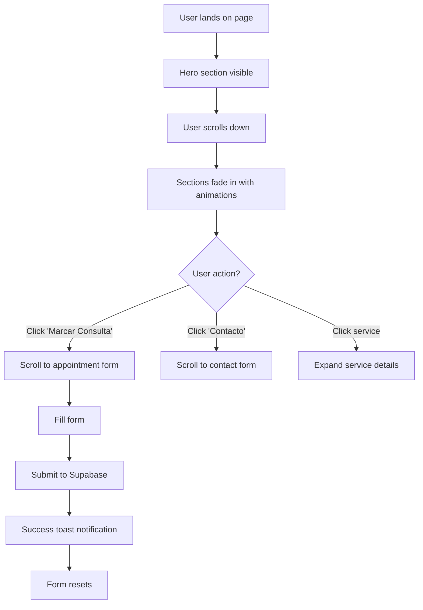

**Validações:**
- ✅ Required fields (name, email, phone, NIF, date, time)
- ✅ Email format validation (Zod)
- ✅ Phone format validation (Portuguese format)
- ✅ NIF validation (9 digits)
- ✅ Date validation (future dates only)
- ✅ Service type selection required

**Melhorias Futuras:**
- [ ] Add reCAPTCHA to prevent spam
- [ ] Integrate Google Reviews API for testimonials
- [ ] Add WhatsApp floating button
- [ ] Add live chat widget
- [ ] SEO optimization (meta tags, structured data)
- [ ] Add blog section
- [ ] Multi-language support (EN/PT)

---

### 3.2 Admin Login

**Status:** ✅ **100% Complete**

**Features:**
- [x] Email + Password authentication
- [x] Remember me (persistent session)
- [x] Loading states
- [x] Error handling
- [x] Redirect to dashboard on success
- [x] Redirect to login if not authenticated

**Decisões Técnicas:**

**Why no password reset?**
- ⏳ **Planned for future**: Supabase provides reset flow, not implemented yet
- **Workaround**: Admin can reset via Supabase dashboard

**Why no 2FA?**
- ⏳ **Planned for future**: Low priority (internal tool)
- **Mitigation**: Strong password policy enforced

**UX Flow:**
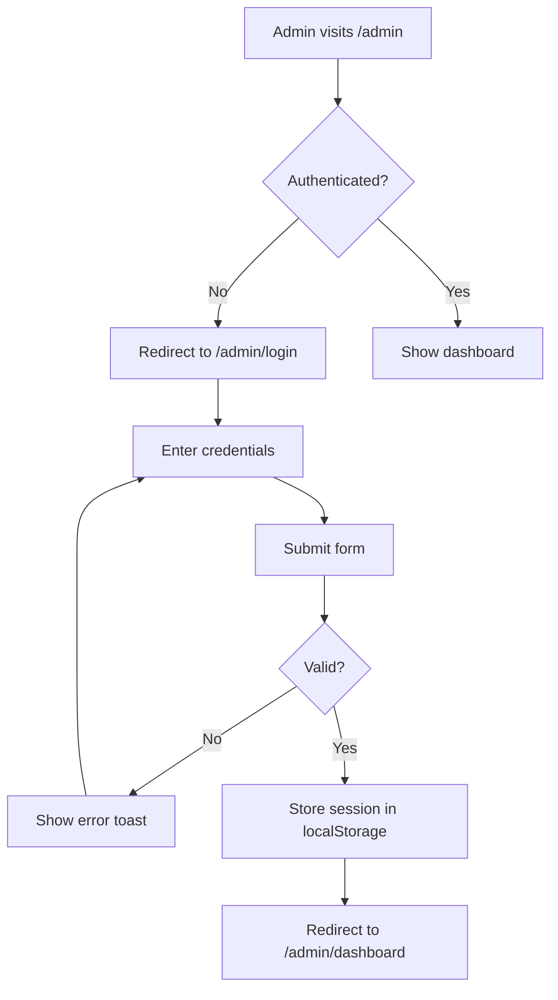

**Validações:**
- ✅ Email format
- ✅ Password minimum length (6 chars)
- ✅ Rate limiting (Supabase built-in)

**Melhorias Futuras:**
- [ ] Password reset flow
- [ ] 2FA via email/SMS
- [ ] Session timeout warning
- [ ] Login history/audit log

---

### 3.3 Admin Dashboard

**Status:** ✅ **90% Complete**

**Features:**
- [x] Overview statistics (4 stat cards)
  - [x] Total appointments (today)
  - [x] Patients in waiting room
  - [x] Pending requests
  - [x] Unread messages
- [x] Appointments chart (last 7 days)
- [x] Revenue chart (monthly)
- [x] Quick actions (create appointment, view requests)
- [x] Recent appointments list
- [x] Real-time data updates (TanStack Query)
- [ ] ⏳ Revenue calculation (placeholder data)

**Decisões Técnicas:**

**Why TanStack Query over Redux?**
- ✅ **Server state focus**: Designed for API data
- ✅ **Auto caching**: Reduces API calls
- ✅ **Auto refetching**: Keeps data fresh
- ✅ **Optimistic updates**: Better UX
- ✅ **Less boilerplate**: No actions/reducers
- ❌ **Not for client state**: Use React state for UI state

**Why Recharts over Chart.js?**
- ✅ **React-first**: Declarative API
- ✅ **Responsive**: Auto-resizes
- ✅ **Customizable**: Easy styling
- ❌ **Larger bundle**: But acceptable for admin panel

**UX Flow:**
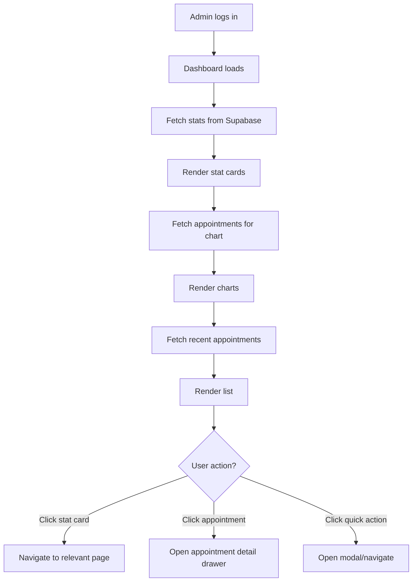

**Melhorias Futuras:**
- [ ] Implement real revenue calculation
- [ ] Add more chart types (pie, bar)
- [ ] Add date range filter
- [ ] Add export to PDF/Excel
- [ ] Add customizable dashboard widgets
- [ ] Add notifications center

---

### 3.4 Agenda (Calendar)

**Status:** ✅ **95% Complete**

**Features:**
- [x] Multiple views (Day, Week, Month)
- [x] Drag-and-drop appointments
- [x] Create appointment wizard (multi-step)
- [x] Edit appointment (drawer)
- [x] Delete appointment (with confirmation)
- [x] Filter by professional
- [x] Filter by specialty
- [x] Color-coded by professional
- [x] Status badges (scheduled, confirmed, waiting, etc.)
- [x] Time slot grid (15-min intervals)
- [x] Conflict detection
- [x] Working hours respect
- [ ] ⏳ Recurring appointments (not implemented)

**Decisões Técnicas:**

**Why dnd-kit over react-beautiful-dnd?**
- ✅ **Modern**: Actively maintained
- ✅ **Accessible**: ARIA support built-in
- ✅ **Performant**: Virtual scrolling support
- ✅ **Flexible**: Works with any layout
- ❌ **More complex API**: But more powerful

**Why multi-step wizard over single form?**
- ✅ **Better UX**: Less overwhelming
- ✅ **Progressive disclosure**: Only show relevant fields
- ✅ **Validation per step**: Immediate feedback
- ❌ **More code**: But worth it for UX

**Appointment Creation Flow:**
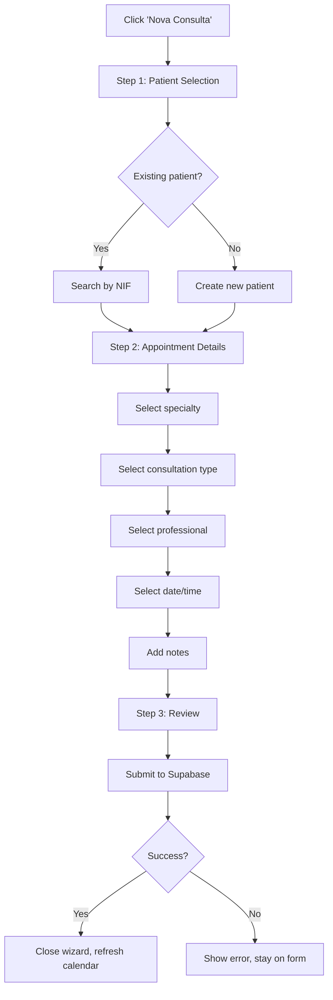

**Validações:**
- ✅ Patient required
- ✅ Specialty required
- ✅ Consultation type required
- ✅ Professional required
- ✅ Date/time required
- ✅ Date must be future (or today)
- ✅ Time must be within working hours
- ✅ No double-booking (same professional, same time)
- ✅ Duration must be positive

**Melhorias Futuras:**
- [ ] Recurring appointments (weekly/monthly)
- [ ] Appointment templates
- [ ] Bulk operations (cancel multiple)
- [ ] Print calendar view
- [ ] iCal export
- [ ] SMS/Email reminders integration
- [ ] Appointment history timeline

---

### 3.5 Pedidos de Marcação (Appointment Requests)

**Status:** ✅ **100% Complete**

**Features:**
- [x] List all requests (table view)
- [x] Filter by status (pending, approved, rejected, converted)
- [x] Sort by date
- [x] View request details
- [x] Approve request → Create appointment
- [x] Reject request (with reason)
- [x] Convert to appointment (wizard)
- [x] Mark as processed
- [x] Delete request
- [x] Pagination (future-ready)

**Decisões Técnicas:**

**Why separate requests from appointments?**
- ✅ **Public vs Internal**: Requests are unverified, appointments are confirmed
- ✅ **Workflow**: Allows admin review before booking
- ✅ **Data quality**: Admin can correct/validate data
- ❌ **Extra step**: But necessary for quality control

**Why not auto-approve requests?**
- ✅ **Quality control**: Prevent spam/invalid requests
- ✅ **Availability check**: Admin verifies slot availability
- ✅ **Patient verification**: Confirm NIF/contact info
- ❌ **Manual work**: But acceptable for clinic workflow

**Request Processing Flow:**
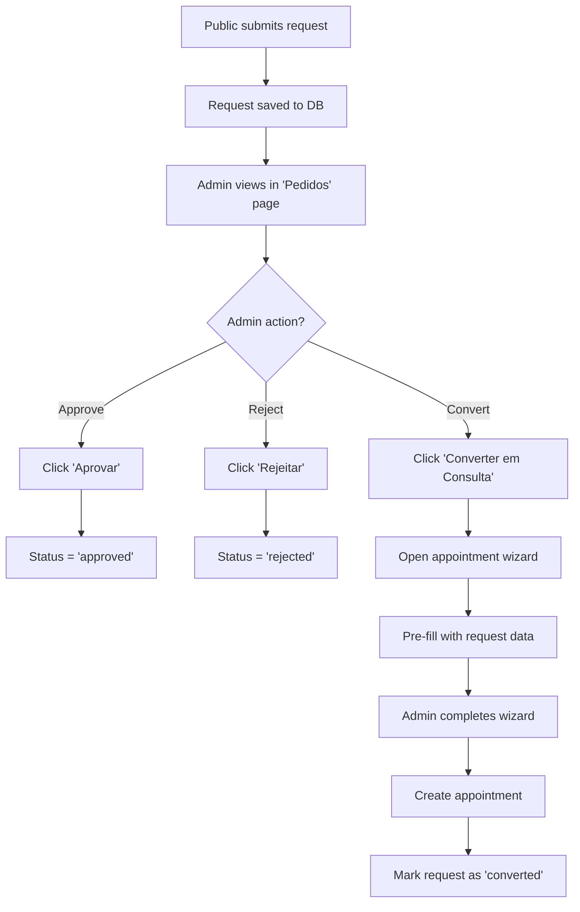

**Validações:**
- ✅ Cannot approve already processed request
- ✅ Cannot convert already converted request
- ✅ Rejection requires confirmation

**Melhorias Futuras:**
- [ ] Auto-suggest available slots
- [ ] Bulk approve/reject
- [ ] Email notification to patient on approval
- [ ] SMS notification option
- [ ] Request expiration (auto-reject after X days)

---

### 3.6 Pacientes (Patients)

**Status:** ✅ **100% Complete**

**Features:**
- [x] List all patients (table view)
- [x] Search by name/NIF/phone
- [x] Filter by tags
- [x] Sort by name/created date
- [x] Create new patient (modal)
- [x] Edit patient (modal)
- [x] Delete patient (with confirmation)
- [x] View patient detail page
  - [x] Patient info
  - [x] Appointment history
  - [x] Notes
  - [x] Tags management
- [x] NIF-based lookup (unique identifier)
- [x] Tags system (array field)

**Decisões Técnicas:**

**Why NIF as unique identifier?**
- ✅ **Portuguese standard**: Tax ID required for invoicing
- ✅ **Unique**: No duplicates possible
- ✅ **Validation**: 9-digit format
- ❌ **Privacy concern**: But necessary for legal compliance

**Why tags as TEXT[] instead of junction table?**
- ✅ **Simpler**: No extra table/joins
- ✅ **Flexible**: Easy to add/remove tags
- ✅ **Performance**: Single query
- ❌ **No tag management UI**: Tags are free-form (future: tag library)

**Patient Creation Flow:**


**Validações:**
- ✅ NIF required and unique
- ✅ NIF must be 9 digits
- ✅ Name required
- ✅ Phone required (Portuguese format)
- ✅ Email optional but must be valid format
- ✅ Birth date optional but must be past

**Melhorias Futuras:**
- [ ] Patient portal (self-service)
- [ ] Medical history (structured data)
- [ ] Allergies/conditions tracking
- [ ] Document upload (consent forms, X-rays)
- [ ] Patient communication history
- [ ] GDPR compliance tools (data export, deletion)

---

### 3.7 Lista de Espera (Waitlist)

**Status:** ✅ **100% Complete**

**Features:**
- [x] List all waitlist entries (table view)
- [x] Sort by priority (high → low)
- [x] Sort by manual order (drag-and-drop)
- [x] Add to waitlist (modal)
- [x] Remove from waitlist
- [x] Convert to appointment (wizard)
- [x] Priority levels (low, medium, high)
- [x] Time preference (morning, afternoon, any)
- [x] Preferred dates (array)
- [x] Reason field
- [x] Filter by specialty/professional

**Decisões Técnicas:**

**Why manual sort_order field?**
- ✅ **Business logic override**: Priority isn't always enough
- ✅ **Drag-and-drop**: Allows manual reordering
- ✅ **Flexibility**: Admin can prioritize based on context
- ❌ **Extra complexity**: But necessary for real-world use

**Why preferred_dates as DATE[]?**
- ✅ **Flexibility**: Patient can specify multiple dates
- ✅ **PostgreSQL native**: Array support built-in
- ✅ **Query-friendly**: Can use array operators
- ❌ **No time slots**: Only dates (acceptable for waitlist)

**Waitlist Flow:**
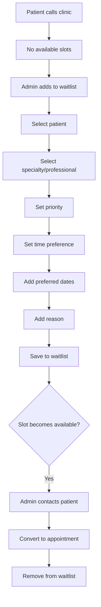

**Validações:**
- ✅ Patient required
- ✅ Priority required
- ✅ Time preference required
- ✅ At least one preferred date recommended

**Melhorias Futuras:**
- [ ] Auto-suggest slots when available
- [ ] SMS notification when slot available
- [ ] Waitlist expiration (auto-remove after X days)
- [ ] Waitlist analytics (average wait time)

---

### 3.8 Sala de Espera (Waiting Room)

**Status:** ✅ **100% Complete**

**Features:**
- [x] Real-time view of patients in waiting room
- [x] Filter appointments with status='waiting'
- [x] Check-in button (scheduled → waiting)
- [x] Start consultation button (waiting → in_progress)
- [x] Complete consultation button (in_progress → completed)
- [x] Patient info display
- [x] Appointment time display
- [x] Professional display
- [x] Auto-refresh (TanStack Query)

**Decisões Técnicas:**

**Why separate waiting room page?**
- ✅ **Focused workflow**: Receptionist-specific view
- ✅ **Real-time updates**: Critical for clinic operations
- ✅ **Simplified UI**: Only relevant actions
- ❌ **Could be dashboard widget**: But better as dedicated page

**Why status transitions?**
- ✅ **Workflow tracking**: Know where patient is in process
- ✅ **Analytics**: Track consultation duration
- ✅ **Audit trail**: Who did what when
- ❌ **Extra clicks**: But necessary for tracking

**Waiting Room Flow:**
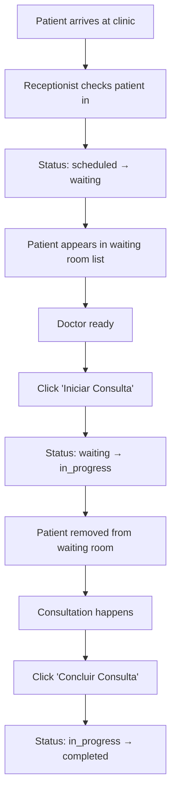

**Validações:**
- ✅ Can only check-in scheduled appointments
- ✅ Can only start waiting appointments
- ✅ Can only complete in_progress appointments

**Melhorias Futuras:**
- [ ] Estimated wait time display
- [ ] Queue position display
- [ ] SMS notification when doctor ready
- [ ] Digital check-in (patient self-service)
- [ ] Waiting room TV display

---

### 3.9 Mensagens (Contact Messages)

**Status:** ✅ **100% Complete**

**Features:**
- [x] List all messages (table view)
- [x] Filter by status (new, read, archived)
- [x] Sort by date
- [x] View message details
- [x] Mark as read
- [x] Archive message
- [x] Delete message
- [x] Reply (future: email integration)

**Decisões Técnicas:**

**Why no email integration?**
- ⏳ **Planned for future**: Requires email service (SendGrid, Mailgun)
- **Workaround**: Admin copies email and replies manually

**Why simple status workflow?**
- ✅ **Sufficient**: new → read → archived covers most cases
- ✅ **Simple**: No complex state machine needed
- ❌ **No assignment**: Can't assign to specific admin (future)

**Message Flow:**
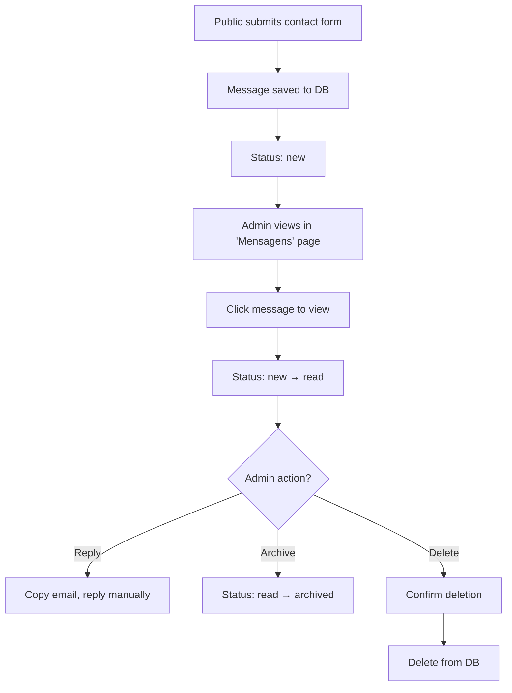

**Validações:**
- ✅ Name required
- ✅ Email required (valid format)
- ✅ Phone required
- ✅ Message required (min 10 chars)

**Melhorias Futuras:**
- [ ] Email integration (reply from admin panel)
- [ ] Message templates
- [ ] Assignment to admin
- [ ] Priority levels
- [ ] Internal notes
- [ ] Message categories

---

### 3.10 Configurações (Settings)

**Status:** ✅ **90% Complete**

**Features:**
- [x] Working hours configuration (per day)
- [x] Default appointment duration
- [x] Buffer between appointments
- [x] Manage specialties (CRUD)
- [x] Manage consultation types (CRUD)
- [x] Manage professionals (CRUD)
- [x] Manage rooms (CRUD)
- [ ] ⏳ Clinic info (name, address, phone) - hardcoded
- [ ] ⏳ Email templates - not implemented
- [ ] ⏳ WhatsApp templates - not implemented

**Decisões Técnicas:**

**Why JSONB for working_hours?**
- ✅ **Flexible schema**: Each day has different structure
- ✅ **Single row**: All hours in one record
- ✅ **Easy updates**: Update entire object
- ❌ **Harder queries**: Can't easily query "all Mondays"

**Why separate modals for each entity?**
- ✅ **Focused UI**: Each modal has specific purpose
- ✅ **Reusable**: Can open from multiple places
- ✅ **Validation**: Specific to each entity
- ❌ **More code**: But better UX

**Settings Flow:**


**Validações:**
- ✅ Working hours: start < end
- ✅ Professional name required
- ✅ Consultation type name required
- ✅ Duration must be positive

**Melhorias Futuras:**
- [ ] Clinic info management
- [ ] Logo upload
- [ ] Email template editor
- [ ] WhatsApp template editor
- [ ] Holiday calendar
- [ ] Blocked time slots
- [ ] Pricing management

---

## 4. ÁREA PÚBLICA

### Páginas
1. **Landing Page** (`/`) - ✅ Complete
2. **404 Not Found** (`/*`) - ✅ Complete

### Navegação
- **Header**: Logo + Nav links (Sobre, Serviços, Equipa, Testemunhos, Contacto)
- **Smooth scroll**: Click nav link → scroll to section
- **Mobile menu**: Hamburger menu for mobile
- **Footer**: Contact info + social links (placeholders)

### SEO
- ⚠️ **Partial implementation**
- [x] Semantic HTML (header, main, section, footer)
- [x] Alt text on images
- [x] Heading hierarchy (h1 → h2 → h3)
- [ ] ⏳ Meta tags (title, description, OG tags)
- [ ] ⏳ Structured data (JSON-LD)
- [ ] ⏳ Sitemap
- [ ] ⏳ Robots.txt

---

## 5. ÁREA ADMIN

### Layout
- **Sidebar**: Collapsible navigation (10 menu items)
- **Header**: User info + logout button
- **Main content**: Page-specific content
- **Responsive**: Sidebar collapses on mobile

### Páginas
1. **Dashboard** (`/admin/dashboard`) - ✅ 90%
2. **Agenda** (`/admin/agenda`) - ✅ 95%
3. **Pedidos** (`/admin/pedidos`) - ✅ 100%
4. **Pacientes** (`/admin/pacientes`) - ✅ 100%
5. **Paciente Detail** (`/admin/pacientes/:id`) - ✅ 100%
6. **Lista de Espera** (`/admin/lista-espera`) - ✅ 100%
7. **Sala de Espera** (`/admin/sala-espera`) - ✅ 100%
8. **Mensagens** (`/admin/mensagens`) - ✅ 100%
9. **Configurações** (`/admin/configuracoes`) - ✅ 90%
10. **Plano** (`/admin/plano`) - ⚠️ Placeholder (future billing)
11. **Faturação** (`/admin/faturacao`) - ⚠️ Placeholder (future billing)

### Permissões
- **All pages**: Require `admin` role
- **RLS enforcement**: Database-level security
- **Frontend guard**: `useAuth()` hook redirects if not authenticated

---

## 6. UX & DESIGN

### 6.1 Design System

**Color Palette:**
- **Primary**: HSL-based (customizable via CSS variables)
- **Gradient**: `bg-primary-gradient` (used in hero, buttons)
- **Semantic colors**: success, warning, destructive, muted
- **Chart colors**: 5-color palette for data visualization

**Typography:**
- **Sans**: Inter (body text)
- **Display**: Space Grotesk (headings)
- **Mono**: JetBrains Mono (code, if needed)

**Spacing:**
- **Tailwind scale**: 0.25rem increments (4px, 8px, 16px, etc.)
- **Container**: Max-width 1280px, centered

**Border Radius:**
- **Default**: `var(--radius)` (customizable)
- **Variants**: lg, md, sm

**Shadows:**
- **8 levels**: 2xs → 2xl
- **Elevation system**: Higher = more shadow

### 6.2 Componentes

**shadcn/ui Components Used (49 total):**
- Accordion, Alert Dialog, Alert, Aspect Ratio, Avatar
- Badge, Breadcrumb, Button, Calendar, Card
- Carousel, Chart, Checkbox, Collapsible, Command
- Context Menu, Dialog, Drawer, Dropdown Menu, Form
- Hover Card, Input, Input OTP, Label, Menubar
- Navigation Menu, Pagination, Popover, Progress, Radio Group
- Resizable, Scroll Area, Select, Separator, Slider
- Slot, Switch, Table, Tabs, Textarea
- Toast, Toaster, Toggle, Toggle Group, Tooltip
- Sonner (toast notifications)

**Custom Components (26 admin + 10 public):**
- All built on top of shadcn/ui primitives
- Consistent styling via Tailwind
- Reusable across pages

### 6.3 Loading States

**Implemented:**
- ✅ Skeleton loaders (tables, cards)
- ✅ Spinner on buttons (form submission)
- ✅ Loading overlay (modals)
- ✅ Optimistic updates (TanStack Query)

**Patterns:**
```tsx
// Table loading
{isLoading ? <Skeleton count={5} /> : <Table data={data} />}

// Button loading
<Button disabled={isLoading}>
  {isLoading && <Spinner />}
  Submit
</Button>
```

### 6.4 Error Handling

**Implemented:**
- ✅ Toast notifications (success, error, info)
- ✅ Form validation errors (inline)
- ✅ API error messages (from Supabase)
- ✅ 404 page
- ❌ Error boundary (not implemented)

**Patterns:**
```tsx
// API error handling
const { mutate, error } = useMutation({
  onError: (err) => toast.error(err.message)
});

// Form validation
{errors.email && <p className="text-destructive">{errors.email.message}</p>}
```

### 6.5 Responsividade

**Breakpoints:**
- `sm`: 640px (mobile landscape)
- `md`: 768px (tablet)
- `lg`: 1024px (desktop)
- `xl`: 1280px (large desktop)

**Mobile-First:**
- ✅ All pages responsive
- ✅ Sidebar collapses on mobile
- ✅ Tables scroll horizontally on mobile
- ✅ Forms stack vertically on mobile
- ✅ Touch-friendly buttons (min 44px)

---

## 7. FLUXOS DE TRABALHO

### 7.1 Criar Consulta (Appointment Creation)

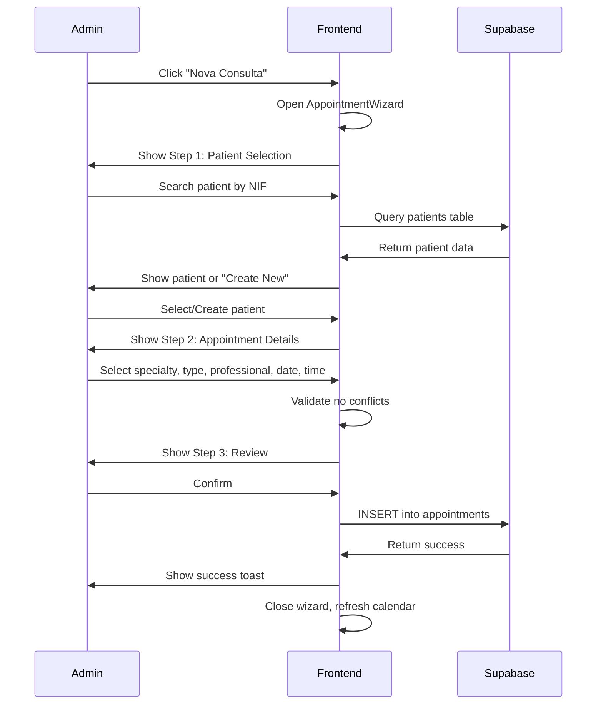

### 7.2 Aprovar Pedido de Marcação (Approve Request)

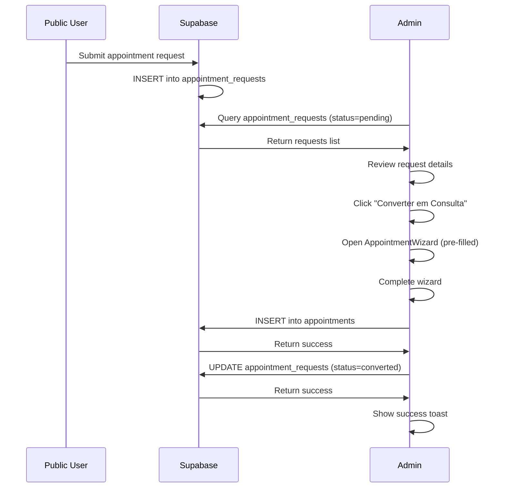

### 7.3 Check-in de Paciente (Patient Check-in)

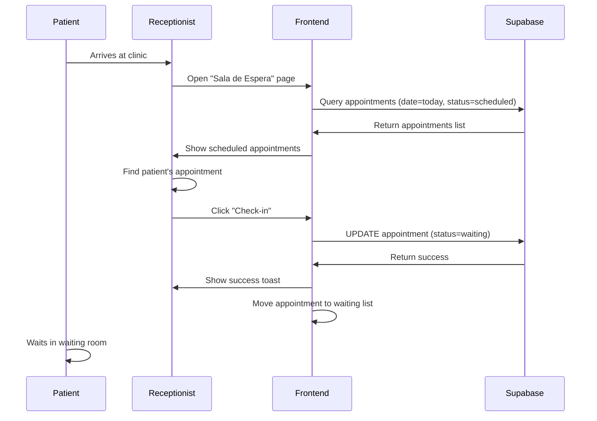

---

## 8. INTEGRAÇÕES

### 8.1 Atuais

**Supabase:**
- ✅ Database (PostgreSQL)
- ✅ Authentication
- ✅ Auto-generated API
- ✅ Row Level Security
- ❌ Storage (not used yet)
- ❌ Realtime (not used yet)

**Google Maps:**
- ✅ Embedded map on landing page
- ❌ Geocoding API (not used)
- ❌ Directions API (not used)

### 8.2 Futuras

**WhatsApp Business API:**
- ⏳ Automated confirmations (24h before)
- ⏳ Review reminders (after consultation)
- ⏳ Availability suggestions (from waitlist)

**Email Service (SendGrid/Mailgun):**
- ⏳ Appointment confirmations
- ⏳ Password reset
- ⏳ Marketing campaigns

**Google Reviews API:**
- ⏳ Fetch reviews automatically
- ⏳ Display on landing page
- ⏳ Replace localStorage testimonials

**Payment Gateway (Stripe/Multibanco):**
- ⏳ Online payments
- ⏳ Invoicing
- ⏳ Subscription management

**SMS Service (Twilio):**
- ⏳ Appointment reminders
- ⏳ 2FA codes
- ⏳ Emergency notifications

---

## 9. ESTADO ATUAL vs ROADMAP

### 9.1 Completo (100%)

**Backend:**
- ✅ Database schema (12 tables)
- ✅ RLS policies
- ✅ Authentication system
- ✅ Auto-generated types

**Frontend - Public:**
- ✅ Landing page
- ✅ Appointment request form
- ✅ Contact form
- ✅ Responsive design

**Frontend - Admin:**
- ✅ Login page
- ✅ Agenda (calendar)
- ✅ Pedidos (requests management)
- ✅ Pacientes (patient management)
- ✅ Lista de Espera (waitlist)
- ✅ Sala de Espera (waiting room)
- ✅ Mensagens (contact messages)

### 9.2 Parcial (70-90%)

**Dashboard:**
- ✅ Stat cards
- ✅ Charts
- ❌ Revenue calculation (placeholder data)
- **Completion:** 90%

**Configurações:**
- ✅ Working hours
- ✅ Manage entities (professionals, types, rooms)
- ❌ Clinic info management
- ❌ Template editors
- **Completion:** 85%

**Agenda:**
- ✅ Day/Week/Month views
- ✅ Drag-and-drop
- ❌ Recurring appointments
- **Completion:** 95%

### 9.3 Pendente (0-30%)

**WhatsApp Integration:**
- ❌ Automated messages
- ❌ Template management
- ❌ Response handling
- **Completion:** 0% (database ready, no integration)

**Billing:**
- ❌ Invoice generation
- ❌ Payment tracking
- ❌ Revenue reports
- **Completion:** 0% (placeholder pages exist)

**Patient Portal:**
- ❌ Patient login
- ❌ View appointments
- ❌ Request appointments
- ❌ View invoices
- **Completion:** 0%

**Advanced Features:**
- ❌ Medical records
- ❌ Document management
- ❌ Inventory management
- ❌ Staff scheduling
- **Completion:** 0%

### 9.4 Roadmap Trimestral

**Q1 2026 (Jan-Mar):**
- [ ] Complete revenue calculation
- [ ] Implement recurring appointments
- [ ] Add email integration (SendGrid)
- [ ] Implement password reset flow
- [ ] SEO optimization (meta tags, structured data)

**Q2 2026 (Apr-Jun):**
- [ ] WhatsApp integration (confirmations + reminders)
- [ ] Google Reviews API integration
- [ ] Patient portal (phase 1: view appointments)
- [ ] Billing system (phase 1: invoice generation)

**Q3 2026 (Jul-Sep):**
- [ ] Medical records system
- [ ] Document upload/management
- [ ] Advanced analytics dashboard
- [ ] Mobile app (React Native)

**Q4 2026 (Oct-Dec):**
- [ ] Multi-clinic support
- [ ] Staff scheduling
- [ ] Inventory management
- [ ] API for third-party integrations

---

## 10. DECISÕES TÉCNICAS & RATIONALE

### 10.1 Framework: React

**Why React over Vue/Angular/Svelte?**

**Prós:**
- ✅ **Ecosystem**: Largest component library ecosystem
- ✅ **Talent pool**: Easier to find React developers
- ✅ **Maturity**: Battle-tested in production
- ✅ **Flexibility**: Not opinionated (can choose own tools)
- ✅ **TypeScript support**: First-class support

**Contras:**
- ❌ **Boilerplate**: More setup than Vue/Svelte
- ❌ **Performance**: Slightly slower than Svelte
- ❌ **Bundle size**: Larger than Preact

**Conclusão:**
React chosen for **ecosystem maturity** and **developer availability**. Performance acceptable for admin panel use case.

---

### 10.2 Build Tool: Vite

**Why Vite over Create React App/Next.js/Webpack?**

**Prós:**
- ✅ **Speed**: Instant dev server start
- ✅ **HMR**: Fast hot module replacement
- ✅ **Modern**: ESM-based, optimized for modern browsers
- ✅ **Simple**: Less configuration than Webpack
- ✅ **TypeScript**: Built-in support

**Contras:**
- ❌ **No SSR**: Not suitable for SEO-critical apps (but we don't need SSR)
- ❌ **Newer**: Less mature than Webpack

**Conclusão:**
Vite chosen for **developer experience** (fast dev server). SSR not needed for admin panel. Landing page SEO handled via static optimization.

---

### 10.3 State Management: TanStack Query

**Why TanStack Query over Redux/Zustand/Jotai?**

**Prós:**
- ✅ **Server state focus**: Designed for API data
- ✅ **Auto caching**: Reduces API calls
- ✅ **Auto refetching**: Keeps data fresh
- ✅ **Optimistic updates**: Better UX
- ✅ **Less boilerplate**: No actions/reducers
- ✅ **DevTools**: Excellent debugging

**Contras:**
- ❌ **Not for client state**: Need separate solution for UI state
- ❌ **Learning curve**: Different mental model

**Conclusão:**
TanStack Query chosen for **server state management**. Client state handled by React useState/useReducer (minimal client state needed).

---

### 10.4 UI Library: shadcn/ui

**Why shadcn/ui over Material-UI/Ant Design/Chakra UI?**

**Prós:**
- ✅ **Copy-paste**: Components copied to project (full control)
- ✅ **Customizable**: Easy to modify
- ✅ **Accessible**: Built on Radix UI (ARIA compliant)
- ✅ **Modern**: Tailwind-based
- ✅ **No bundle bloat**: Only include what you use

**Contras:**
- ❌ **Manual updates**: Need to copy new versions
- ❌ **More setup**: Not npm install

**Conclusão:**
shadcn/ui chosen for **customization** and **accessibility**. Copy-paste approach allows full control over components.

---

### 10.5 Styling: TailwindCSS

**Why TailwindCSS over CSS Modules/Styled Components/Emotion?**

**Prós:**
- ✅ **Utility-first**: Fast development
- ✅ **Consistency**: Design system via config
- ✅ **Performance**: Purged CSS (small bundle)
- ✅ **No naming**: No CSS class naming conflicts
- ✅ **Responsive**: Built-in breakpoints

**Contras:**
- ❌ **Verbose HTML**: Long className strings
- ❌ **Learning curve**: Need to learn utility classes

**Conclusão:**
TailwindCSS chosen for **development speed** and **consistency**. Verbose HTML acceptable trade-off.

---

### 10.6 Forms: React Hook Form + Zod

**Why React Hook Form over Formik?**

**Prós:**
- ✅ **Performance**: Uncontrolled inputs (less re-renders)
- ✅ **Bundle size**: Smaller than Formik
- ✅ **TypeScript**: Better type inference
- ✅ **Validation**: Integrates with Zod

**Contras:**
- ❌ **API**: Different from Formik (learning curve)

**Why Zod over Yup?**

**Prós:**
- ✅ **TypeScript-first**: Infers types from schema
- ✅ **Composable**: Easy to build complex schemas
- ✅ **Error messages**: Better customization

**Contras:**
- ❌ **Bundle size**: Slightly larger than Yup

**Conclusão:**
React Hook Form + Zod chosen for **performance** and **TypeScript integration**.

---

### 10.7 Backend: Supabase

**Why Supabase over Firebase/AWS Amplify/Custom Backend?**

**Prós:**
- ✅ **PostgreSQL**: Relational database (better for clinic data)
- ✅ **RLS**: Database-level security
- ✅ **Open source**: Can self-host if needed
- ✅ **Auto-generated API**: No backend code needed
- ✅ **TypeScript types**: Auto-generated from schema
- ✅ **Real-time**: WebSocket support (future use)

**Contras:**
- ❌ **Vendor lock-in**: Harder to migrate than custom backend
- ❌ **Less flexible**: Can't customize API logic easily

**Conclusão:**
Supabase chosen for **rapid development** and **PostgreSQL**. RLS provides security without backend code.

---

### 10.8 Authentication: Supabase Auth

**Why Supabase Auth over Auth0/Clerk/Custom?**

**Prós:**
- ✅ **Integrated**: Same platform as database
- ✅ **Free tier**: Generous limits
- ✅ **RLS integration**: Seamless with database
- ✅ **JWT tokens**: Standard authentication

**Contras:**
- ❌ **Less features**: No social login (yet)
- ❌ **Less customizable**: Limited UI customization

**Conclusão:**
Supabase Auth chosen for **integration** with Supabase database. Social login not needed for admin panel.

---

### 10.9 Drag & Drop: dnd-kit

**Why dnd-kit over react-beautiful-dnd?**

**Prós:**
- ✅ **Modern**: Actively maintained
- ✅ **Accessible**: ARIA support built-in
- ✅ **Performant**: Virtual scrolling support
- ✅ **Flexible**: Works with any layout

**Contras:**
- ❌ **More complex API**: Steeper learning curve

**Conclusão:**
dnd-kit chosen for **accessibility** and **active maintenance**. react-beautiful-dnd is deprecated.

---

### 10.10 Charts: Recharts

**Why Recharts over Chart.js/Victory/Nivo?**

**Prós:**
- ✅ **React-first**: Declarative API
- ✅ **Responsive**: Auto-resizes
- ✅ **Customizable**: Easy styling
- ✅ **Composable**: Build complex charts from primitives

**Contras:**
- ❌ **Bundle size**: Larger than Chart.js
- ❌ **Performance**: Slower for large datasets

**Conclusão:**
Recharts chosen for **React integration** and **customization**. Performance acceptable for admin panel (small datasets).

---

**End of FUNCTIONAL_ANALYSIS.md**

*This document provides complete functional analysis. For backend details, see BACKEND_REPLICATION.md*
